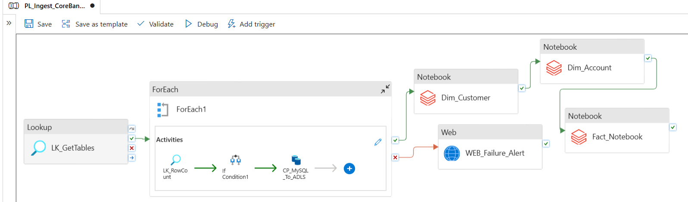
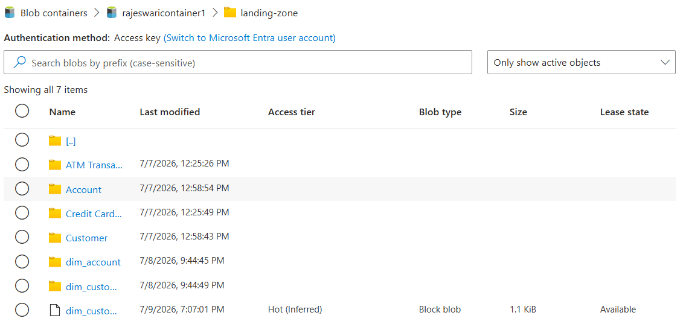
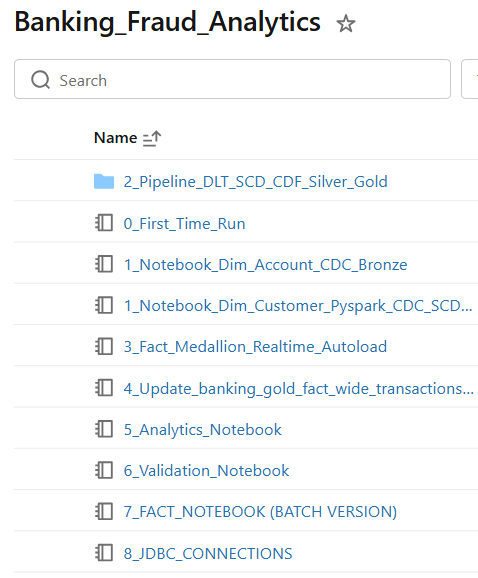
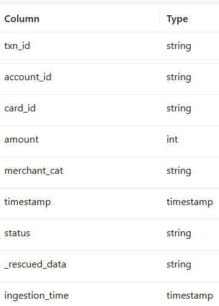
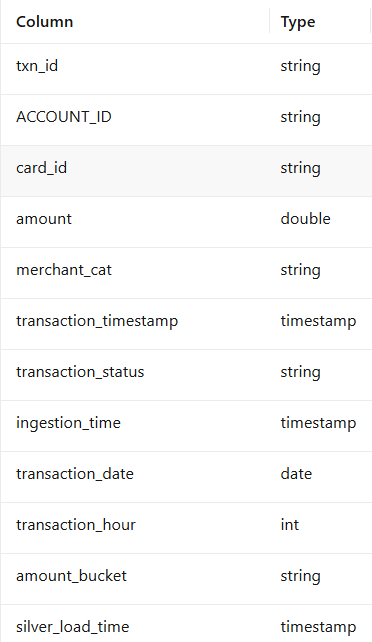
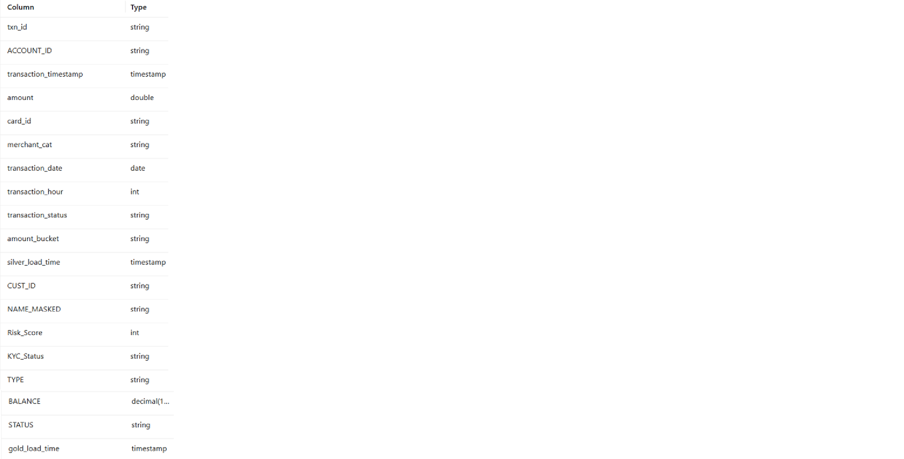
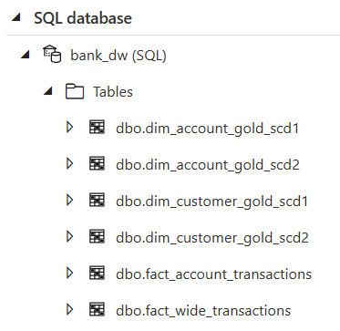
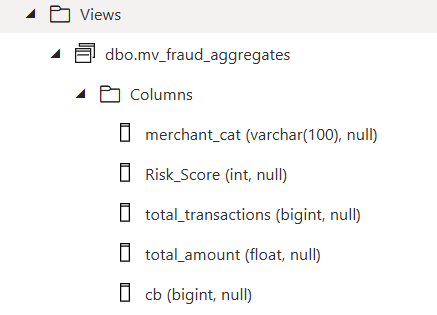
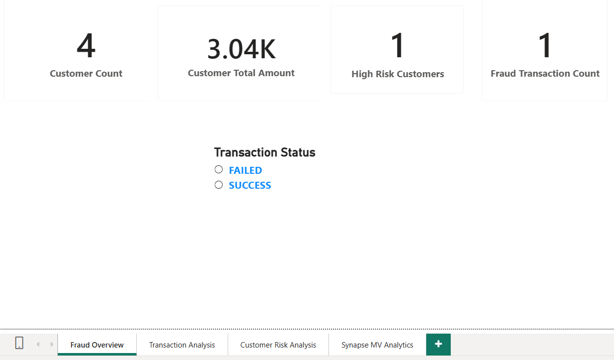

# Banking-Fraud-Analytics-Data-Engineering
End-to-end Banking Fraud Analytics project using Azure Data Factory, ADLS Gen2, Databricks, Delta Lake, Azure Synapse and Power BI.

# 🏦 Unified Financial Risk Lakehouse

## End-to-End Banking Fraud Analytics using Azure Data Engineering


---

# 📌 Project Overview

The **Unified Financial Risk Lakehouse** is an end-to-end Azure Data Engineering project that demonstrates how banking transaction data is ingested, transformed, stored, and visualized using the Medallion Architecture (Bronze → Silver → Gold).

The solution uses **Azure Data Factory** for orchestration, **Azure Data Lake Storage Gen2** for storage, **Azure Databricks (PySpark)** for data processing, **Azure Synapse Analytics** as the enterprise data warehouse, and **Power BI** for interactive dashboards.

The project implements:

- Azure Data Factory Pipeline
- Medallion Architecture (Bronze → Silver → Gold)
- Auto Loader
- Data Quality Validation
- SCD Type 1
- SCD Type 2
- Delta Lake
- Azure Synapse Analytics
- Materialized Views
- Power BI Reporting

---

# 🏗️ Solution Architecture

```
Source Files
     │
     ▼
Azure Data Factory
     │
     ▼
Azure Data Lake Storage Gen2
     │
     ▼
Azure Databricks
Bronze → Silver → Gold
     │
     ▼
Azure Synapse Analytics
     │
     ▼
Materialized Views
     │
     ▼
Power BI Dashboard
```

---

# 🛠️ Technology Stack

| Category | Technology |
|------------|----------------------------|
| Cloud | Microsoft Azure |
| Orchestration | Azure Data Factory |
| Storage | Azure Data Lake Storage Gen2 |
| Processing | Azure Databricks |
| Language | PySpark |
| Programming | Python |
| Query Language | SQL |
| Storage Format | Delta Lake |
| Warehouse | Azure Synapse Analytics |
| Reporting | Power BI |
| Version Control | Git & GitHub |

---

# 📂 Medallion Architecture

## 🥉 Bronze Layer

- Raw Data Ingestion
- Delta Tables
- Auto Loader
- Audit Columns
- Landing Zone Storage

---

## 🥈 Silver Layer

- Data Cleansing
- Data Validation
- Duplicate Removal
- Standardization
- Business Transformations
- Derived Columns

---

## 🥇 Gold Layer

- Fact Tables
- Dimension Tables
- SCD Type 1
- SCD Type 2
- Analytics Ready Data

---

# 📊 Features

- End-to-End Azure Data Engineering
- Medallion Architecture
- Auto Loader
- CDC Processing
- SCD Type 1 & Type 2
- Data Quality Validation
- Delta Lake
- Azure Synapse Analytics
- Materialized Views
- Interactive Power BI Dashboard

---

# 📸 Project Screenshots

## Azure Data Factory Pipeline

Azure Data Factory orchestrates the complete ETL workflow including metadata-driven ingestion, data copy, Databricks notebook execution, and failure handling.



---

## Azure Data Lake Storage Gen2

ADLS Gen2 acts as the centralized storage layer for raw banking datasets and intermediate files.



---

## Azure Databricks Workspace

Azure Databricks contains notebooks for CDC processing, Medallion Architecture, validation, analytics, and Synapse integration.



---

## Bronze Layer

The Bronze layer stores raw source data exactly as received from upstream systems.



---

## Silver Layer

The Silver layer applies cleansing, schema standardization, deduplication, and business transformations.



---

## Gold Layer

The Gold layer contains enriched business-ready datasets by combining transaction, customer, and account information.



---

## Azure Synapse Analytics

Curated Gold layer fact and dimension tables are loaded into Azure Synapse Dedicated SQL Pool for analytical workloads.



---

## Materialized View

Materialized views are created in Azure Synapse to improve analytical query performance and Power BI reporting.



---

## Power BI Dashboard

Power BI dashboards provide interactive fraud analytics, customer risk analysis, transaction monitoring, and KPI reporting.



---

# 📁 Project Structure

```
Unified-Financial-Risk-Lakehouse
│
├── ADF
│
├── Databricks
│   ├── Bronze
│   ├── Silver
│   ├── Gold
│
├── Synapse
│
├── PowerBI
│
├── Documentation
│
├── Screenshots
│   ├── adf_pipeline.png
│   ├── adls_storage.png
│   ├── databricks_workspace.png
│   ├── bronze_layer.png
│   ├── silver_layer.png
│   ├── gold_layer.png
│   ├── synapse_sql_pool.png
│   ├── materialized_view.png
│   └── powerbi_dashboard.png
│
└── README.md
```

---

# 📈 Dashboard Highlights

- Customer Count
- Customer Total Amount
- High Risk Customers
- Fraud Transactions
- Transaction Status
- Customer Risk Analysis
- Transaction Analysis

---

# 🎯 Skills Demonstrated

- Azure Data Factory
- Azure Data Lake Storage Gen2
- Azure Databricks
- PySpark
- Python
- SQL
- Delta Lake
- Medallion Architecture
- Auto Loader
- CDC
- Data Quality Validation
- SCD Type 1
- SCD Type 2
- Azure Synapse Analytics
- Materialized Views
- Power BI
- Git
- GitHub

---

# 🚀 Future Enhancements

- Azure Event Hubs Integration
- Kafka Streaming
- CI/CD with Azure DevOps
- GitHub Actions
- Unity Catalog
- ML-based Fraud Detection
- Real-time Alerting

---


# 👩‍💻 Author

**Rajeswari**

**Azure Data Engineer | PySpark | Python | SQL | Azure Databricks | Azure Synapse Analytics | Power BI**

---

⭐ If you found this project useful, consider giving it a **Star** on GitHub!
